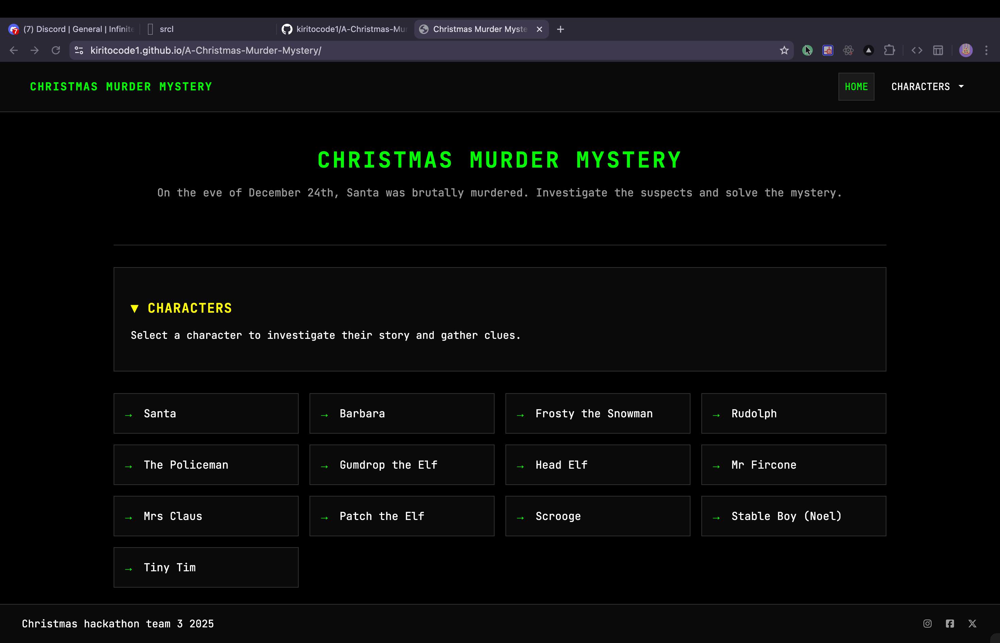

# A-Christmas-Murder-Mystery

A Christmas &apos;Who done it?&apos; mystery game with terminal aesthetics.

## 🎮 Live Demo

**Deployed on GitHub Pages:** [https://kiritocode1.github.io/A-Christmas-Murder-Mystery/index.html](https://kiritocode1.github.io/A-Christmas-Murder-Mystery/index.html)

## 📖 About

On the eve of December 24th, Santa was brutally murdered. Investigate the suspects and solve the mystery.

## 🎨 Features

-   Terminal/Advent of Code aesthetic design
-   Interactive character investigation
-   13 unique characters to explore
-   Monospace font styling with dark theme
-   Responsive design

## 🕵️ Characters

-   Santa
-   Barbara
-   Frosty the Snowman
-   Rudolph
-   The Policeman
-   Gumdrop the Elf
-   Head Elf
-   Mr Fircone
-   Mrs Claus
-   Patch the Elf
-   Scrooge
-   Stable Boy (Noel)
-   Tiny Tim

## 🛠️ Technologies

-   HTML5
-   CSS3
-   Bootstrap 5
-   Font Awesome

## 📝 License

Christmas hackathon team 3 2025
